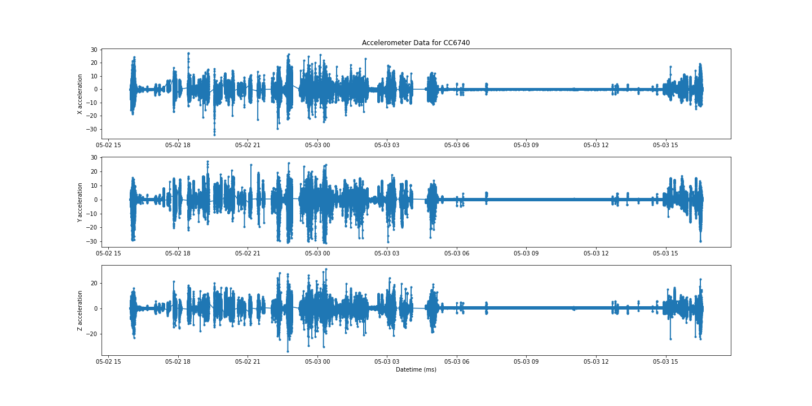
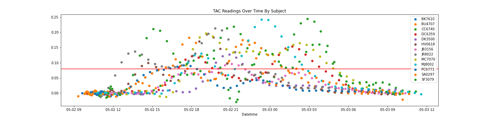

# Detect Heavy Drinking Episodes Using Smartphone Accelerometer Data
* Jump to [How to run](#how-to-run)

## Abstract/ Summary:
Just-in-time adaptive interventions (JITAIs) are a promising area of research in health domains, and have been used to detect heavy drinking episodes before their onset. This projects aims to improve on the study ["Learning to Detect Heavy Drinking Episodes Using Smartphone Accelerometer Data" (Killian et al., 2019)](http://ceur-ws.org/Vol-2429/paper6.pdf). The study provides smartphone accelerometer data from 13 participants before and after a bar crawl and their blood alcohol content via transdermal alcohol concentration (TAC). Given a 10 second window of non-zero accelerometer data, I predict whether the TAC is above 0.08 (intoxicated). 

During preprocessing, I resampled the accelerometer data at 1000Hz to obtain a reading for every millisecond between a subject's minimum to maximum timestamp. I engineered features at the 10 second window level using a two-tiered windowing approach similar to the technique used in the original study. My final dataset for modeling had 135 features and 72,521 rows. The class balance was around 36% intoxicated and 64% not intoxicated. <b> My best classifier (a stacked ensemble) detected "intoxication" with accuracy 0.86 and F1 score 0.81, surpassing the original study's best model performance. </b>

### Objective: 
Given a 10 second window of non-zero accelerometer data, predict whether the TAC is above 0.08 (intoxicated). Report accuracy and F1 scores.

### Data: [Link](https://archive.ics.uci.edu/ml/datasets/Bar+Crawl%3A+Detecting+Heavy+Drinking)

<b> Accelerometer data:</b> all_accelerometer_data_pids_13.csv - 14,057,567 rows, 5 columns (time in unix milliseconds, pid, x, y, z)

As seen in the sample plot below for participant CC6740, the accelerometer data was typically collected in a 24-hour period starting around mid-afternoon. The study disclosed that the bar crawl was an 18-hour long event.

While the study states that the accelerometer data was collected at 40Hz, the timestamps on the data show inconsistent time intervals between each reading. For example, data collected for participant CC6740 had intervals ranging from 0 milliseconds to 2,157,503 milliseconds. The inconsistent sampling rate could introduce bias when taking descriptive statistics on a 10-minute window. This problem was addressed in data preprocessing.

<b> TAC data:</b> clean_tac/*.csv - 13 files with 715 rows total, 2 columns (timestamp unix seconds, TAC_Reading )

The TAC files in clean_tac have been preprocessed by the original researchers with a low-pass filter and time shift of 45-minutes. The study states that TAC readings were collected every 30 minutes, at a much slower rate than the accelerometer data. The graph below shows the spread of raw TAC readings by pid, with the "intoxicated" threshold of 0.08 in red. It looks like there might be potential issues with class imbalance.

As seen below, the "intoxicated" class represents 24% of the raw samples. 
.png)

### Data Preprocessing:
Preprocessing the data had the largest effect on performance metrics.

### Feature Engineering:

### Feature Importance:

### Model Performance:

Model | Accuracy | F1 Score
--- | --- | --- 
Baseline RF (sklearn) | 0.8563 | 0.7987
XGBoost (H2O AutoML) | 0.8549 | 0.8066
<b>Stacked Ensemble (H2O AutoML)</b> | <b>0.8598</b> | <b>0.8140</b>

Best model performance of original study: Accuracy 0.7748, F1 score 0.6815.

## How to run:

