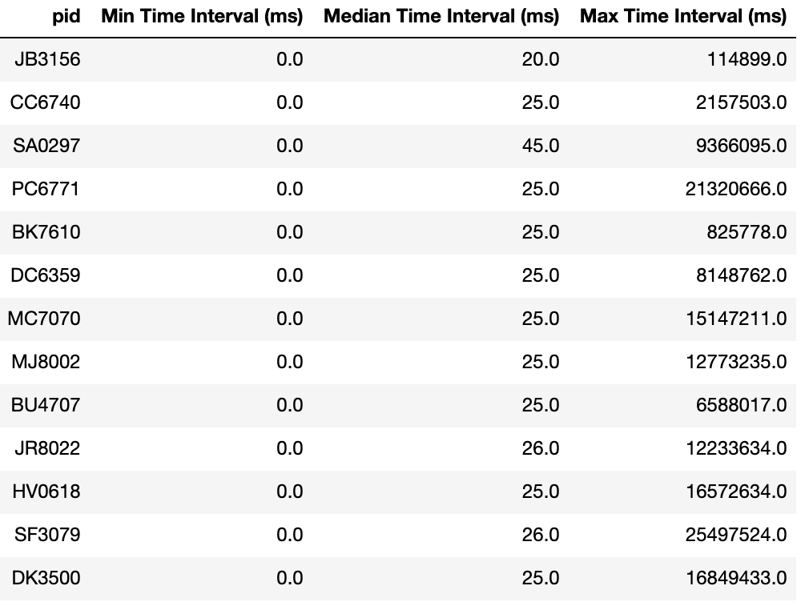
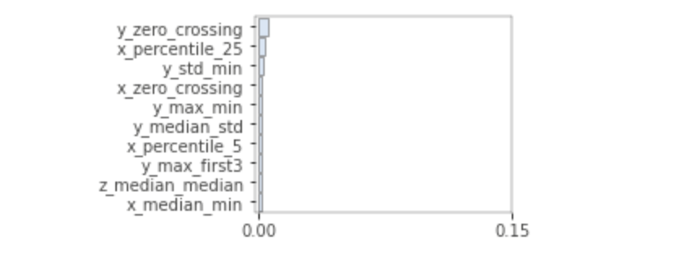

# Detect Heavy Drinking Episodes Using Smartphone Accelerometer Data
* Jump to [How to run](#how-to-run)

## Abstract/ Summary:
Just-in-time adaptive interventions (JITAIs) are a promising area of research in health domains, and have been used to detect heavy drinking episodes before their onset. This projects aims to improve on the study ["Learning to Detect Heavy Drinking Episodes Using Smartphone Accelerometer Data" (Killian et al., 2019)](http://ceur-ws.org/Vol-2429/paper6.pdf). The study provides smartphone accelerometer data from 13 participants before and after a bar crawl and their blood alcohol content via transdermal alcohol concentration (TAC). Given a 10-second window of non-zero accelerometer data, I predict whether the TAC is above 0.08 (intoxicated). 

During preprocessing, I upsampled the accelerometer data at 1000Hz to obtain a reading for every millisecond between a subject's minimum to maximum timestamp. I engineered features at the 10-second window level using a two-tiered windowing approach similar to the technique used in the original study. My final dataset for modeling had 135 features and 72,521 rows. The class balance was around 36% intoxicated and 64% not intoxicated. <b> My best classifier (a stacked ensemble) detected "intoxication" with accuracy 0.86 and F1 score 0.81, surpassing the original study's best model performance. </b>

### I. Objective: 
Given a 10-second window of non-zero accelerometer data, predict whether the TAC is above 0.08 (intoxicated). Report accuracy and F1 scores.

### II. Data: [Link](https://archive.ics.uci.edu/ml/datasets/Bar+Crawl%3A+Detecting+Heavy+Drinking)

<b> Accelerometer data:</b> all_accelerometer_data_pids_13.csv - 14,057,567 rows, 5 columns (time in unix milliseconds, pid, x, y, z)

As seen in the sample plot below for participant CC6740, the accelerometer data was typically collected in a 24-hour period starting around mid-afternoon. The study disclosed that the bar crawl was an 18-hour long event.


While the study states that the accelerometer data was collected at 40Hz, the timestamps on the data show inconsistent time intervals between each reading. For example, data collected for participant CC6740 had intervals ranging from 0 milliseconds to 2,157,503 milliseconds. The inconsistent sampling rate could introduce bias when taking descriptive statistics on a 10-minute window. This problem was addressed in data preprocessing.




<b> TAC data:</b> clean_tac/*.csv - 13 files with 715 rows total, 2 columns (timestamp unix seconds, TAC_Reading)

The TAC files in clean_tac have been preprocessed by the researchers with a low-pass filter and time shift of 45-minutes. The study states that TAC readings were collected every 30 minutes, at a much slower rate than the accelerometer data. The graph below shows the spread of raw TAC readings by pid, with the "intoxicated" threshold of 0.08 in red. It looks like there might be potential issues with class imbalance.


As seen below, the "intoxicated" class (thresholded in preprocessing) represents 24% of the raw samples. 
.png)

### III. Data Preprocessing:
To address the inconsistent sampling rate in the accelerometer data, I upsampled the data at 1000Hz to create a row for every millisecond between a subject's minimum and maximum timestamp. I imputed missing values in these new rows by taking the x, y, z acceleration from the previous millisecond. The rationale behind this method is that although researchers set a sampling rate of 40Hz, it is possible that the readings are only recorded when there is a change in the accelerometer data. This is typically how sensor event listeners function in [android](https://developer.android.com/reference/android/hardware/SensorEventListener) and [apple](https://developer.apple.com/documentation/webkitjs/domwindow/1632048-ondevicemotion) products. Therefore it is reasonable to impute missing values with values from the last timestamp at which the reading was recorded. Upsampling increased the number of rows by up to 100-fold depending on the participant.

I also preprocesed the clean_tac data to create a binary "intoxicated" variable with the threshold of > 0.08.

### VI. Feature Engineering:
With every millisecond accounted for after preprocessing, statistics taken on a set 10-second window will now have less bias.

<b>Windowing:</b> During feature engineering, I performed <b>two-tiered windowing</b> similar to the approach used in the orignal study. For every 10-second segment, I further segmented the window down to 1-second segments. I computed metrics for each 1-second segment, then computed the mean, median, standard deviation, max and min of the metric over the 10 1-second segments to characterize how it changes over the 10-second window. I also took the mean of the first and last three seconds of the 10-second window. I additionally performed single-tier windowing, computing percentiles to capture the distribution over the 10-second window. After windowing and feature engineering, I had 72,521 rows and 135 features. 

<b>Reconciling target data with features: </b> Since the TAC data was sampled at a much slower rate than the accelerometer data (about once every 30 minutes), I merged the TAC data onto the accelerometer data by taking the most recent "intoxicated" value where the TAC timestamp is less than or equal to the accelerometer timestamp. Class balance improved, with the share of "intoxicated" samples increasing to 36%.
.png')

<b>Feature Importance:</b> I ran feature importance on my baseline random forest model to see which engineered features were most predictive, and found the "zero crossing" features to be important as expected. I decided to retain all 135 features as training time was still manageable.



### V. Model Performance:

Model | Accuracy | F1 Score
--- | --- | --- 
Baseline RF (sklearn) | 0.8563 | 0.7987
XGBoost (H2O AutoML) | 0.8549 | 0.8066
<b>Stacked Ensemble (H2O AutoML)</b> | <b>0.8598</b> | <b>0.8140</b>

Best model performance of original study: Accuracy 0.7748, F1 score 0.6815.

Since my baseline random forest model had decent metrics, I decided to use H2O's AutoML to find the top 10 models and hyperparameters. H2O ranks the classifiers based on AUC. The best classifier was a stacked ensemble of tree-based models, with an accuracy of 0.86 and F1 score of 0.81.
Model selection and hyperparameter tuning did not drastically improve metrics, emphasizing the importance of data preprocessing and feature engineering instead.


## How to run:
### Set Up (do this once only)
Clone the project repository and enter
```
git clone THIS REPO ADDRESS
cd detect_heavy_drinking
```
Create virtual environment from .yml file
```
conda env create -f detect_heavy_drinking.yml –n [env_name]
```
Activate virtual environment
```
source activate [env_name]
```
Install new kernel for our virtual environment
```
ipython kernel install --user --name=[env_name]
```
*Make sure to  specify correct kernel when opening a jupyter notebook.

### Run
